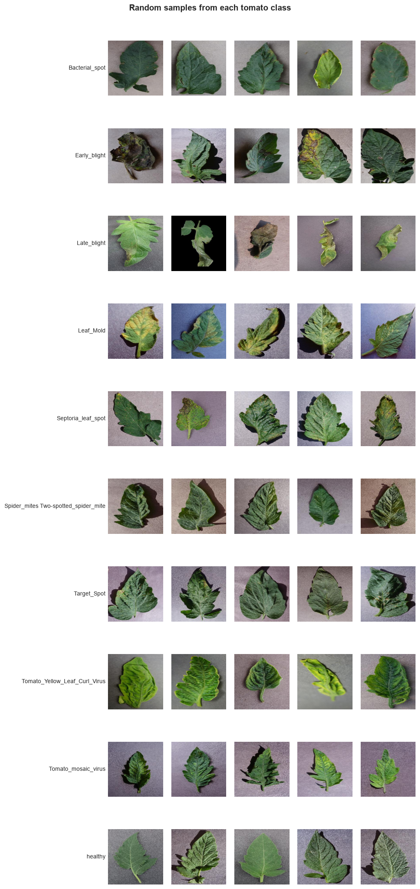
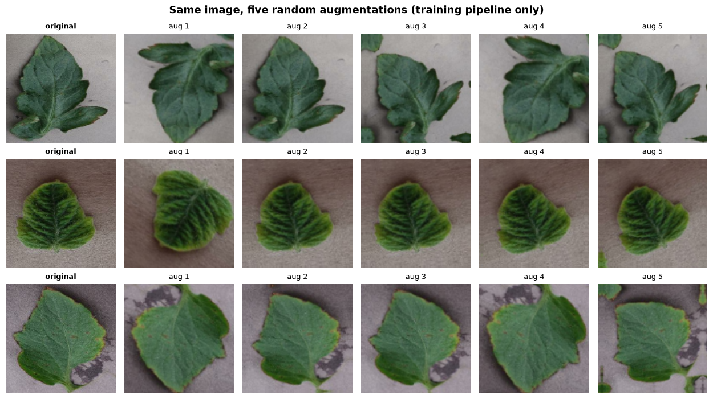

# Crop Disease Detection

A deep-learning web app that identifies plant diseases from a photo of a leaf.

Upload a leaf image and the app returns the predicted disease along with a
confidence score. The model is a small **Convolutional Neural Network (CNN)**
built from scratch with TensorFlow/Keras and trained on the
[PlantVillage](https://www.kaggle.com/datasets/abdallahalidev/plantvillage-dataset)
dataset from Kaggle. It is served through a lightweight **Flask** web app.

> **Status:** Phase 3 of 7 complete — data pipeline built and verified. Later
> phases add the trained model, evaluation and the web app.
> Sections marked *Coming soon* below get filled in as those phases land.

### Why this project?

Crop disease is a major cause of yield loss, and early identification usually
depends on an expert being physically present. A phone camera plus an image
classifier makes a first-pass diagnosis available to anyone. This repository is
a compact, end-to-end demonstration of that idea: **raw data → preprocessing →
model → evaluation → deployed app.**

---

## Setup

### Prerequisites

- **Python 3.10–3.12.** TensorFlow does not publish builds for Python 3.13+ yet,
  so a newer Python will fail at `pip install`.
- A [Kaggle account](https://www.kaggle.com/) for downloading the dataset
  (needed from Phase 2 onward).

### 1. Clone the repository

```bash
git clone https://github.com/NIKHILis-Coder/CROP-DISEASE-DETECTION.git
cd CROP-DISEASE-DETECTION
```

### 2. Create and activate a virtual environment

A virtual environment keeps this project's libraries separate from every other
Python project on your machine, so versions can't clash.

```bash
# Windows (PowerShell) -- the "py -3.12" part picks a TensorFlow-compatible Python
py -3.12 -m venv venv
venv\Scripts\Activate.ps1
```

```bash
# macOS / Linux
python3.12 -m venv venv
source venv/bin/activate
```

Your prompt should now start with `(venv)`.

### 3. Install the dependencies

```bash
pip install -r requirements.txt
```

### 4. Set up Kaggle API access *(needed from Phase 2)*

1. On Kaggle: **Account → Settings → API → Create New Token.** This downloads a
   `kaggle.json` file containing your username and API key.
2. Move it to the location the Kaggle library looks in:
   - Windows: `C:\Users\<you>\.kaggle\kaggle.json`
   - macOS / Linux: `~/.kaggle/kaggle.json` (then run `chmod 600 ~/.kaggle/kaggle.json`)

`kaggle.json` is a **secret** — it is listed in `.gitignore` and must never be
committed.

---

## Project structure

```
CROP-DISEASE-DETECTION/
│
├── data/                  # All dataset files (contents ignored by Git)
│   ├── raw/               # Untouched PlantVillage images as downloaded
│   └── processed/         # Split manifests (CSV of filepath + label)
│
├── notebooks/             # Jupyter notebooks for exploration and experiments
│   ├── 01_eda.ipynb       # Exploratory data analysis of the tomato subset
│   ├── 02_pipeline_check.ipynb  # Verifies the preprocessing pipeline is correct
│   └── figures/           # Plots saved by the notebooks (embedded in this README)
│
├── src/                   # Reusable Python code (download, preprocess, train, evaluate)
│   ├── download_data.py   # Fetches PlantVillage and extracts the tomato classes
│   └── data_loader.py     # Manifest, stratified split, tf.data + augmentation
│
├── models/                # Saved trained models (.keras / .h5 — ignored by Git)
│
├── app/                   # The Flask web application
│   ├── templates/         # HTML pages rendered by Flask
│   └── static/            # CSS, images, and user-uploaded files
│
├── requirements.txt       # Python dependencies
├── .gitignore             # Files Git should not track
├── INTERVIEW_PREP.md      # Design decisions + Q&A, written up phase by phase
└── README.md              # This file
```

**Why this layout?** Data, code, models and the app each live in their own
folder, so any one of them can be changed without touching the others. It is the
conventional structure for a small ML project (a trimmed-down version of the
widely used *Cookiecutter Data Science* template), which means another developer
can find their way around it immediately.

`data/raw` is kept strictly read-only: nothing ever writes back into it, so the
slow download never has to be repeated and any bug can be traced to a pristine
source. `data/processed` holds only the **split manifests** — see
[Preprocessing](#preprocessing) for why no processed images are written to disk.

---

## Dataset

**Source:** the [PlantVillage dataset](https://www.kaggle.com/datasets/abdallahalidev/plantvillage-dataset)
on Kaggle — 54,305 lab photographs of healthy and diseased leaves covering 38
classes across 14 crops, released for public research use.

**Scope used here:** the **tomato subset only** — **18,160 colour images across
10 classes** (nine diseases plus healthy). Download and extraction are scripted
in [`src/download_data.py`](src/download_data.py); the full exploration lives in
[`notebooks/01_eda.ipynb`](notebooks/01_eda.ipynb).

| Class | Images | Share |
|-------|-------:|------:|
| Tomato Yellow Leaf Curl Virus | 5,357 | 29.5% |
| Bacterial spot | 2,127 | 11.7% |
| Late blight | 1,909 | 10.5% |
| Septoria leaf spot | 1,771 | 9.8% |
| Spider mites (two-spotted) | 1,676 | 9.2% |
| Healthy | 1,591 | 8.8% |
| Target spot | 1,404 | 7.7% |
| Early blight | 1,000 | 5.5% |
| Leaf mold | 952 | 5.2% |
| Tomato mosaic virus | 373 | 2.1% |
| **Total** | **18,160** | **100%** |


### Why subset to tomato?

**Training time.** The model here is a small CNN trained **from scratch on a
CPU** — no pre-trained weights, no GPU. Cutting the data from 54k images to 18k
cuts every training epoch to roughly a third, which is the difference between
iterating on the architecture several times an evening and waiting overnight per
run. Fast iteration matters more than raw scale for a project whose point is to
demonstrate the pipeline end to end.

**A sharper, more honest problem.** All 10 classes are the same crop, so the
model must separate *diseases of tomato* rather than the much easier task of
telling an apple leaf from a grape leaf. Distinguishing early blight from late
blight is genuinely hard and visually subtle; distinguishing corn from tomato is
not. A high score on the tomato subset therefore means considerably more than
the same score across all 38 classes.

**Tomato is the natural choice** for the subset: it is the single best-
represented crop in PlantVillage, with the widest range of diseases, so it gives
10 classes without any of them being uselessly small.

### What the data looks like



**Key findings from the EDA:**

- **Perfectly uniform format.** Every one of the 18,160 images is **256×256 RGB
  JPEG** — 100% square, a single aspect ratio. Resizing for the CNN is therefore
  a clean downscale with no distortion or cropping decisions.
- **Zero corrupt files.** All 18,160 passed a `PIL.Image.verify()` integrity
  check, so the data loader needs no error handling for unreadable images.
- **Moderate class imbalance — 14.4×** between the largest class (Yellow Leaf
  Curl Virus, 5,357) and the smallest (Tomato mosaic virus, 373). This sets the
  **majority-class baseline at 29.5%**: a model that ignores the image entirely
  and always guesses the biggest class would score that. Any reported accuracy
  has to be read against that number.
- **Consequences for later phases:** the train/val/test split must be
  **stratified** so rare classes appear in every split, and evaluation must
  report a **confusion matrix and per-class recall**, not accuracy alone.

**Known limitation:** PlantVillage images are laboratory photographs of single
detached leaves on plain backgrounds. A model trained on them will not
automatically work on a phone photo taken in a field, where soil, sky and
overlapping foliage fill the frame. This *domain gap* is the honest caveat about
the finished app.

### Reproducing the dataset locally

```bash
python src/download_data.py               # download + extract the tomato subset
python src/download_data.py --delete-zip  # ...and remove the 2 GB archive after
```

## Preprocessing

Implemented in [`src/data_loader.py`](src/data_loader.py); verified end to end in
[`notebooks/02_pipeline_check.ipynb`](notebooks/02_pipeline_check.ipynb).

```
data/raw/tomato/<class>/*.JPG
        │  build_manifest()      scan folders → (filepath, label) table
        │  split_manifest()      stratified 70 / 15 / 15
        │                        → data/processed/{train,val,test}_manifest.csv
        │  make_dataset()        decode → resize 128×128 → scale to [0,1]
        │  build_augmentation()  flip / rotate / zoom  ← TRAINING ONLY
        ▼
   batched, prefetched tf.data.Dataset → model.fit()
```

### Why 128×128?

The source images are 256×256. Halving each side quarters the pixel count and
therefore roughly quarters the convolution work per image — the difference
between iterating on the architecture several times in an evening and waiting
overnight per run, which matters because this model trains **from scratch on a
CPU**.

We do not go smaller. At 96×96 the fine speckling that separates Septoria leaf
spot from Target Spot begins to smear together, and a model cannot learn a
feature its input no longer contains. 128×128 keeps lesion texture legible while
staying cheap.

### Why in-graph preprocessing instead of writing processed images to disk?

`data/processed/` holds **only the split manifests** — three CSVs of file paths
and labels. No resized image is ever written. Resizing, normalising and
augmenting happen inside the `tf.data` graph as images stream to the model.

- **Augmentation *must* be on the fly.** Its entire purpose is that the model
  sees a differently distorted copy of each image every epoch. Pre-computing it
  would freeze a fixed set of variants and give away most of the benefit.
- **No stale derived data.** Changing the input size from 128 to 160 means
  changing one constant. With a pre-processed copy on disk there would be a
  second dataset that silently disagrees with the code that produced it — a
  genuinely nasty class of bug.
- **Cheaper.** No second 18k-image copy to write, store, or keep in sync.
- **The split, by contrast, *is* persisted** — precisely because it must never
  change. A reshuffled split between training and evaluation would leak training
  images into the test set and inflate the score.

### Stratified 70 / 15 / 15 split

| Split | Images | Share | Imbalance ratio |
|-------|-------:|------:|----------------:|
| Train | 12,712 | 70% | 14.4× |
| Validation | 2,724 | 15% | 14.3× |
| Test | 2,724 | 15% | 14.4× |

**Stratified** means each split preserves the overall class proportions. With a
14.4× imbalance, a plain random split could deal the 373-image mosaic-virus
class an unlucky hand and leave its test score meaningless. Measured result:
the largest drift in any class's share between any two splits is **0.1
percentage points**, and the imbalance ratio is preserved in all three.

<details>
<summary>Per-class counts for every split</summary>

| Class | Train | Val | Test | Total |
|-------|------:|----:|-----:|------:|
| Tomato Yellow Leaf Curl Virus | 3,750 | 803 | 804 | 5,357 |
| Bacterial spot | 1,489 | 319 | 319 | 2,127 |
| Late blight | 1,336 | 287 | 286 | 1,909 |
| Septoria leaf spot | 1,240 | 266 | 265 | 1,771 |
| Spider mites (two-spotted) | 1,173 | 251 | 252 | 1,676 |
| Healthy | 1,114 | 239 | 238 | 1,591 |
| Target spot | 983 | 210 | 211 | 1,404 |
| Early blight | 700 | 150 | 150 | 1,000 |
| Leaf mold | 666 | 143 | 143 | 952 |
| Tomato mosaic virus | 261 | 56 | 56 | 373 |
| **Total** | **12,712** | **2,724** | **2,724** | **18,160** |

</details>

### Augmentation — training split only

| Layer | Setting | What real-world variation it models |
|-------|---------|-------------------------------------|
| `RandomFlip` | horizontal + vertical | A leaf has no inherent "up" — a flip never changes the diagnosis |
| `RandomRotation` | ±0.1 (≈±36°) | Camera not held perfectly square to the leaf |
| `RandomZoom` | ±0.1 | Camera slightly nearer or further away |



**Why modest, and what is deliberately excluded:**

- **No brightness/contrast/hue jitter.** Diagnosis here depends on colour —
  yellow mottling means mosaic virus, brown concentric rings mean early blight.
  Shifting hues would destroy the exact signal the model needs, and could push an
  image towards the appearance of a *different* disease while keeping its
  original label. That is worse than no augmentation: it teaches the model
  something false.
- **No shear or heavy perspective warping.** These are flat, square-on lab
  photographs. Simulating extreme perspective invents a distribution that
  appears in neither the training nor the test data.
- **No random cropping.** A lesion may be anywhere on the leaf; a crop can
  remove the only diseased region while keeping the "diseased" label.

Rotation and zoom stay at ±10% because larger rotations pad the corners with
empty pixels, and a model will happily learn to read that padding artefact
instead of the leaf.

**Validation and test data are never augmented** — they exist to estimate
performance on real, untouched images. The pipeline check confirms both are
bit-for-bit identical across two passes.

### Batching and prefetching

Batch size **32**, with `num_parallel_calls=AUTOTUNE` on image decoding and
`prefetch(AUTOTUNE)` at the end. Decoding JPEGs is CPU work that would otherwise
leave the model idle between batches; prefetching overlaps it with training, so
while the model processes batch *N* the CPU is already assembling batch *N+1*.

### Rebuilding the split

```bash
python src/data_loader.py    # writes data/processed/*.csv and prints the breakdown
```

The manifests live under `data/processed/`, which is gitignored, so they are not
committed. They do not need to be: the split is derived from a sorted file scan
with a fixed `random_state=42`, so re-running the command on any machine
reproduces the identical split. `load_splits()` regenerates them automatically if
they are missing.

## Model

*Coming soon (Phase 4).* Will cover: the CNN architecture layer by layer, why
each layer is there, parameter count, and training configuration.

## Results

*Coming soon (Phase 5).* Will cover: test accuracy, confusion matrix,
per-class precision/recall, and examples the model gets wrong.

## Usage

*Coming soon (Phase 6).* Will cover: how to run the Flask app locally and how
to classify your own leaf photo.

---

## Roadmap

| Phase | Deliverable | Status |
|-------|-------------|--------|
| 1 | Project structure, dependencies, README | ✅ Done |
| 2 | Dataset download + exploratory data analysis | ✅ Done |
| 3 | Preprocessing and augmentation pipeline | ✅ Done |
| 4 | Build and train the CNN | ⬜ Not started |
| 5 | Evaluation: accuracy, confusion matrix, error analysis | ⬜ Not started |
| 6 | Flask web app | ⬜ Not started |
| 7 | Final README polish and screenshots | ⬜ Not started |

## Tech stack

| Tool | Role |
|------|------|
| TensorFlow / Keras | Define and train the CNN |
| NumPy / pandas | Numerical arrays and tabular summaries |
| matplotlib / seaborn | Plots and the confusion-matrix heatmap |
| scikit-learn | Evaluation metrics |
| Pillow | Image loading and resizing |
| Flask | Web app serving the predictions |
| Kaggle API | Scripted dataset download |
