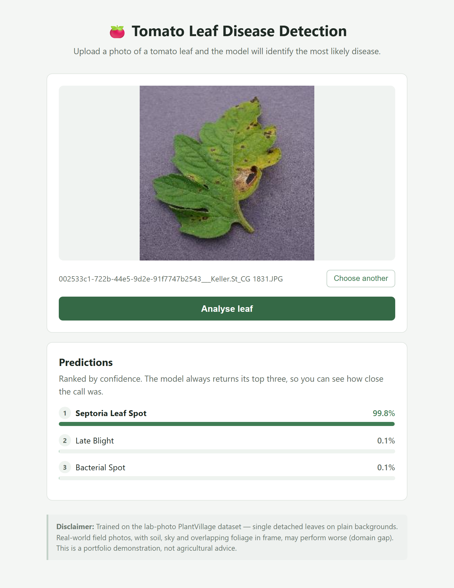
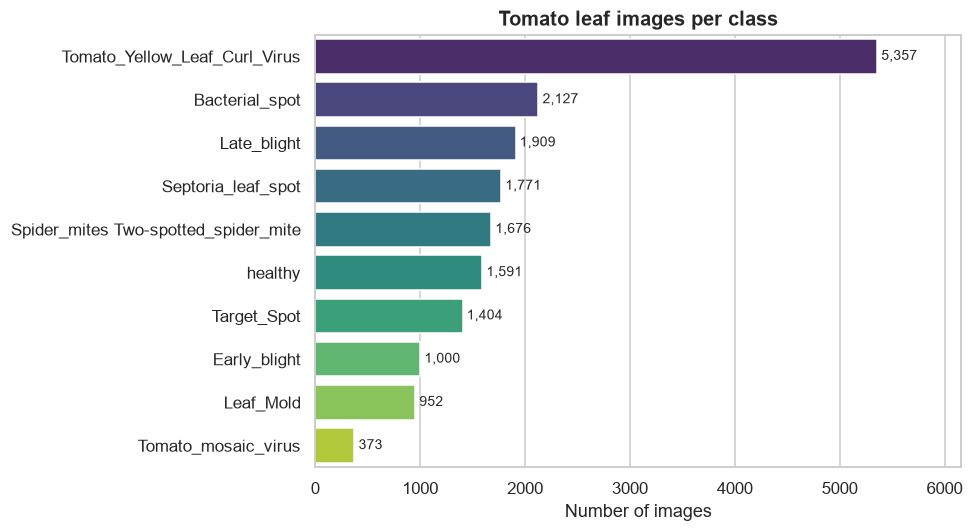
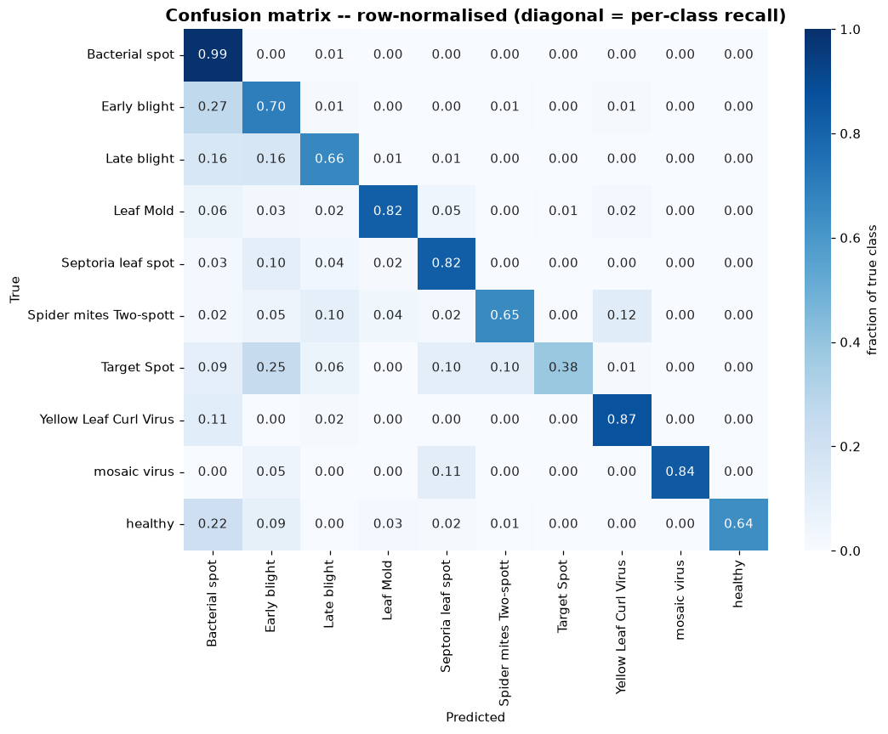

# 🍅 Crop Disease Detection

**Identify tomato leaf diseases from a photo, using a CNN trained from scratch and served through a Flask web app.**



---

## The problem

Crop disease is one of the largest causes of yield loss worldwide, and
identifying it early usually depends on an expert being physically present. A
smartphone camera plus an image classifier puts a first-pass diagnosis in the
hands of anyone with a phone.

This repository is a compact, honest, end-to-end demonstration of that idea:
**raw data → exploration → preprocessing → model → evaluation → deployed app** —
including the parts that went wrong and what was done about them.

---

## Dataset

The [PlantVillage dataset](https://www.kaggle.com/datasets/abdallahalidev/plantvillage-dataset)
on Kaggle — 54,305 laboratory photographs of healthy and diseased leaves across
38 classes and 14 crops.

This project uses the **tomato subset**: **18,160 colour images across 10
classes** (nine diseases plus healthy). Download and extraction are scripted in
[`src/download_data.py`](src/download_data.py), which pulls only the tomato
classes straight out of the 162,916-file archive.



| Property | Value |
|---|---|
| Images | 18,160 |
| Classes | 10 (9 diseases + healthy) |
| Resolution | 256×256 RGB JPEG — **100%** of images |
| Corrupt files | **0** |
| Class imbalance | **14.4×** (5,357 → 373 images) |
| Majority-class baseline | **29.5%** |

**Why tomato only?** It is the best-represented crop in PlantVillage, giving 10
classes without any being uselessly small. More importantly it makes the problem
*harder and more meaningful*: the model must separate diseases of the same
species — early blight from late blight from Septoria leaf spot — rather than
the much easier task of telling an apple leaf from a corn leaf.

Full exploration in [`notebooks/01_eda.ipynb`](notebooks/01_eda.ipynb).

---

## Preprocessing

```
data/raw/tomato/<class>/*.JPG
        │  build_manifest()      scan folders → (filepath, label) table
        │  split_manifest()      stratified 70 / 15 / 15
        │                        → data/processed/{train,val,test}_manifest.csv
        │  make_dataset()        decode → resize 64×64 → scale to [0,1]
        │  build_augmentation()  flip / rotate / zoom  ← TRAINING ONLY
        ▼
   batched, prefetched tf.data.Dataset → model.fit()
```

| Split | Images | Share | Imbalance preserved |
|-------|-------:|------:|---:|
| Train | 12,712 | 70% | 14.4× |
| Validation | 2,724 | 15% | 14.3× |
| Test | 2,724 | 15% | 14.4× |

The split is **stratified** so every class keeps its proportions — measured
drift between splits is **0.1 percentage points**. It is written to CSV and
committed, so the exact split is reproducible from the repository and cannot
silently reshuffle between training and evaluation.

**Augmentation (training split only):** `RandomFlip` (a leaf has no inherent
"up"), `RandomRotation(0.1)`, `RandomZoom(0.1)`. Deliberately **no colour or
brightness jitter** — several of these diseases are identified *by* hue, so
shifting colours would attack the exact signal the model needs and could push an
image toward the appearance of a different disease while keeping its original
label.

Verified end to end in
[`notebooks/02_pipeline_check.ipynb`](notebooks/02_pipeline_check.ipynb): batch
shapes, pixel range, label alignment, augmentation randomness, and that
validation/test are bit-for-bit identical across passes.

---

## Model

A small CNN trained **from scratch** — no pre-trained weights, no GPU.

```
Input (64, 64, 3)
   │
   ├─ Conv2D(32, 3×3, relu, same) ─ BatchNorm ─ MaxPool(2×2)   → 32×32×32
   ├─ Conv2D(64, 3×3, relu, same) ─ BatchNorm ─ MaxPool(2×2)   → 16×16×64
   ├─ Conv2D(128, 3×3, relu, same) ─ BatchNorm ─ MaxPool(2×2)  →  8×8×128
   │
   ├─ GlobalAveragePooling2D                                    → 128
   ├─ Dense(128, relu)                                          → 128
   ├─ Dropout(0.5)
   └─ Dense(10, softmax)                                        → 10 classes

Total parameters: 111,946  (111,498 trainable + 448 BatchNorm moving averages)
Optimiser: Adam (lr 1e-3) · Loss: sparse categorical crossentropy
```

**Why so small?** Because the data sets the ceiling, not ambition. With 12,712
training images, a multi-million-parameter model memorises rather than
generalises.

**`GlobalAveragePooling2D` instead of `Flatten` is the highest-leverage choice
here.** `Flatten` on the 8×8×128 feature map would feed 8,192 values into
`Dense(128)` — about 1.05M parameters, roughly ten times the entire current
model, concentrated in one layer. Global average pooling gives 128 values and
16,512 parameters instead, and adds translation invariance: a lesion in the
corner means the same thing as one in the centre.

**Class imbalance** is handled with inverse-frequency `class_weight` (0.339 for
the largest class up to 4.870 for the rarest — a 14.4× ratio mirroring the
imbalance exactly), rather than oversampling or focal loss.

---

## Results

Measured on the **held-out test split** (2,724 images), untouched by training,
early stopping or checkpoint selection.

| Metric | Value |
|---|---|
| **Test accuracy** | **76.76%** |
| Test loss | 0.7188 |
| **Macro F1** | **0.7448** |
| **Weighted F1** | **0.7732** |
| Majority-class baseline | 29.5% |
| **Lift over baseline** | **+47.3 points** |



| Class | Precision | Recall | F1 | Support |
|---|---:|---:|---:|---:|
| Tomato mosaic virus | 1.00 | 0.84 | **0.91** | 56 |
| Yellow Leaf Curl Virus | 0.95 | 0.87 | **0.91** | 804 |
| Leaf mold | 0.84 | 0.82 | 0.83 | 143 |
| Septoria leaf spot | 0.83 | 0.82 | 0.82 | 265 |
| Healthy | 1.00 | 0.64 | 0.78 | 238 |
| Spider mites | 0.86 | 0.65 | 0.74 | 252 |
| Bacterial spot | 0.54 | 0.99 | 0.70 | 319 |
| Late blight | 0.74 | 0.66 | 0.70 | 286 |
| Target spot | 0.98 | 0.38 | 0.55 | 211 |
| Early blight | 0.39 | 0.70 | **0.50** | 150 |

**Macro-F1 sits only 0.028 below weighted-F1**, meaning performance is fairly
even across classes rather than propped up by the large ones — the class
weighting worked. Strikingly, the *rarest* class (mosaic virus) scores the
joint-highest F1, because visual distinctiveness matters more than frequency.

**Where it struggles:** Bacterial spot acts as a "sink" (0.99 recall, 0.54
precision — the model retreats to it when uncertain), and Early blight and
Target spot confuse each other heavily. Both are the expected cost of 64×64
inputs, which destroy the fine texture that separates them.

Full analysis in
[`notebooks/04_evaluation.ipynb`](notebooks/04_evaluation.ipynb).

---

## Setup

### Prerequisites

- **Python 3.10–3.12** — TensorFlow publishes no wheels for 3.13+
- A [Kaggle account](https://www.kaggle.com/) for the dataset

### 1. Clone and create an environment

```bash
git clone https://github.com/NIKHILis-Coder/CROP-DISEASE-DETECTION.git
cd CROP-DISEASE-DETECTION
```

```bash
# Windows -- "py -3.12" picks a TensorFlow-compatible Python
py -3.12 -m venv venv
venv\Scripts\Activate.ps1
```

```bash
# macOS / Linux
python3.12 -m venv venv
source venv/bin/activate
```

### 2. Install dependencies

```bash
pip install -r requirements.txt
```

### 3. Kaggle credentials

1. Kaggle → **Settings → API → Create New Token** (downloads `kaggle.json`)
2. Move it to `C:\Users\<you>\.kaggle\kaggle.json` (Windows) or
   `~/.kaggle/kaggle.json` (macOS/Linux, then `chmod 600`)

`kaggle.json` is a secret — it is gitignored and must never be committed.

### 4. Download data, train, evaluate, run

```bash
python src/download_data.py     # fetch + extract the tomato subset (~2 GB)
python src/data_loader.py       # build the stratified split manifests
python src/train.py             # timed benchmark only (2 epochs, saves nothing)
python src/train.py --full      # the real training run
python src/evaluate.py          # test-set metrics, confusion matrices
cd app && python app.py         # http://localhost:5000
```

---

## Project structure

```
CROP-DISEASE-DETECTION/
│
├── data/
│   ├── raw/                    # PlantVillage images (gitignored)
│   └── processed/              # split manifests -- CSVs ARE committed
│
├── notebooks/
│   ├── 01_eda.ipynb            # class distribution, samples, image stats
│   ├── 02_pipeline_check.ipynb # correctness checks on the data pipeline
│   ├── 04_evaluation.ipynb     # test-set results and interpretation
│   └── figures/                # every plot embedded in this README
│
├── src/
│   ├── download_data.py        # scripted Kaggle download + tomato extraction
│   ├── data_loader.py          # manifest, stratified split, tf.data pipeline
│   ├── model.py                # build_model() -- the CNN
│   ├── train.py                # benchmark + full training with callbacks
│   └── evaluate.py             # test metrics, confusion matrices, error grid
│
├── models/                     # *.keras gitignored; metrics + logs committed
│   ├── training_history.json
│   ├── training_log.txt
│   ├── evaluation_metrics.json
│   └── aborted_run_summary.txt # incident record of a killed training run
│
├── app/
│   ├── app.py                  # Flask server
│   ├── templates/index.html
│   ├── static/style.css
│   └── README.md
│
├── .github/workflows/ci.yml    # install + import + shape smoke test
├── INTERVIEW_PREP.md           # design decisions and incident write-ups
├── INTERVIEW_PREP.pdf          # the same, formatted
├── requirements.txt
├── LICENSE
└── README.md
```

---

## Tech stack

| Tool | Role |
|------|------|
| **TensorFlow / Keras** | CNN definition, training, `tf.data` input pipeline |
| **scikit-learn** | Stratified splitting, confusion matrix, classification report |
| **pandas / NumPy** | Split manifests, tabular summaries, array maths |
| **matplotlib / seaborn** | Training curves, confusion heatmaps, sample grids |
| **Pillow** | Image decoding in the web app |
| **Flask** | Web app serving predictions |
| **Kaggle API** | Scripted dataset download |
| **GitHub Actions** | Install + import + model-shape smoke test |

---

## Known limitations

**The lab-vs-field domain gap is the biggest one.** Every PlantVillage image is
a laboratory photograph of a *single detached leaf on a plain background*. A real
user photographs a leaf still on the plant, with soil, sky and overlapping
foliage in frame, under uncontrolled lighting. The test split shares the
training distribution, so a good test score proves the pipeline works — it does
**not** prove the model would survive a real phone photo.

**The model is undertrained.** Training stopped at a 5-epoch cap with validation
loss still falling and early stopping never firing. The reported numbers are a
**floor**, not a converged result.

**64×64 inputs cost real accuracy.** The resolution was reduced from 128×128
after two training runs failed to complete on a 7.5 GB laptop under heavy memory
pressure. Fine texture is lost, which shows up directly as Early blight ↔ Target
spot confusion.

**No out-of-distribution detection.** A softmax over 10 classes must sum to 1, so
uploading a photo of a dog returns a confident tomato disease. The app shows
top-3 confidences and a disclaimer, but cannot say "none of these".

**Class imbalance persists.** 14.4× between largest and smallest, mitigated with
class weights but not eliminated.

---

## Future work

- **Transfer learning with MobileNetV2 or EfficientNet-B0** — the single highest-
  value change. Pre-trained ImageNet features would likely reach 95%+ in a
  fraction of the training time, since the model would no longer need to learn
  edge and texture detectors from 12,712 images.
- **Retrain at 128×128 on a GPU** — directly targets the Early blight ↔ Target
  spot confusion, and removes the constraint that forced the reduction.
- **Train to convergence** — let early stopping actually fire instead of hitting
  an epoch cap.
- **Field-photo data** to close the domain gap, or aggressive background/lighting
  augmentation as a cheaper approximation.
- **Out-of-distribution detection** so the app can decline to answer.
- **Extend beyond tomato** to the full 38-class PlantVillage set once training
  cost is no longer the binding constraint.
- **Containerise and deploy** behind Gunicorn with a real WSGI server, plus
  monitoring of the confidence and predicted-class distributions to detect drift.

---

## License

[MIT](LICENSE) © 2026 Nikhil Rana
